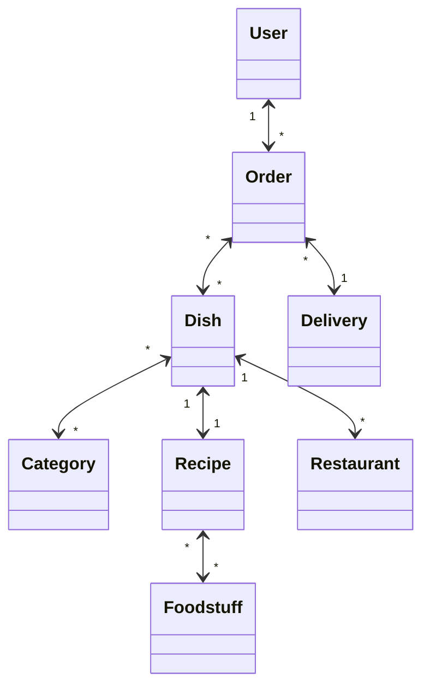

# Лабораторная работа № 1

## Студенты:
- Карасёва Мария
- Назаренко Арсений

## Группа:
P34312

## Архитектура БД:
### Доставка еды

> Пользователь может иметь несколько заказов. Каждый заказ включает в себя блюда, одно блюдо может быть включено в несколько заказов. Блюдо может относиться к нескольким категориям, разные блюда могут входить в одну и ту же категорию. Ресторан содержит в своем меню разные блюда, каждое из которых имеет свой рецепт. В состав рецепта входит список продуктов. Разные составы могут содержать одинаковые продукты. Курьер отвественен за доставку нескольких разных заказов.

