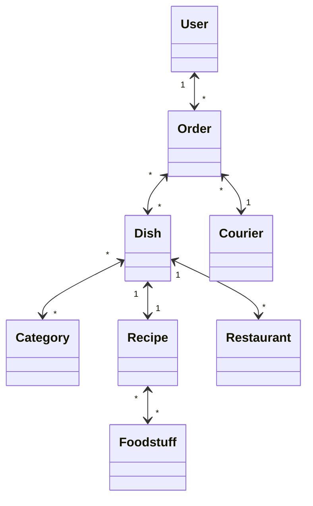

# Лабораторная работа № 1

## Студенты:
- Карасёва Мария
- Назаренко Арсений

## Группа:
P34312

## Архитектура БД:
### Доставка еды

> Каждый пользователь может иметь несколько рецептов, рецепт может относиться к нескольким категориям (блюда без глютена, постные, веганские, диетические и т.д.), между рецептом и продуктом питания отношение "многие ко многим" с дополнительным полем "количество в граммах". Каждый рецепт будет иметь поле "статус" c одним из значений: принят, отклонен, в обработке.
